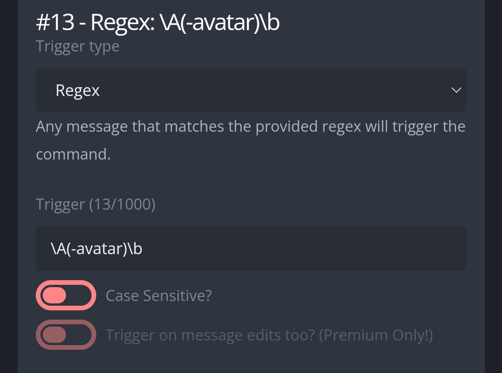

# Avatar
Show profile pictures. 

# Use 
**-avatar** Send your profile pictures  
**-avatar [Target]** Send someone else's profile picture  

# Set up
Create a new Custom Command. In the response box, paste the code found in "Regex: \A(-avatar)\b" and configure the triggert type and trigger as follows:  

  

Then it's ready to be used.
