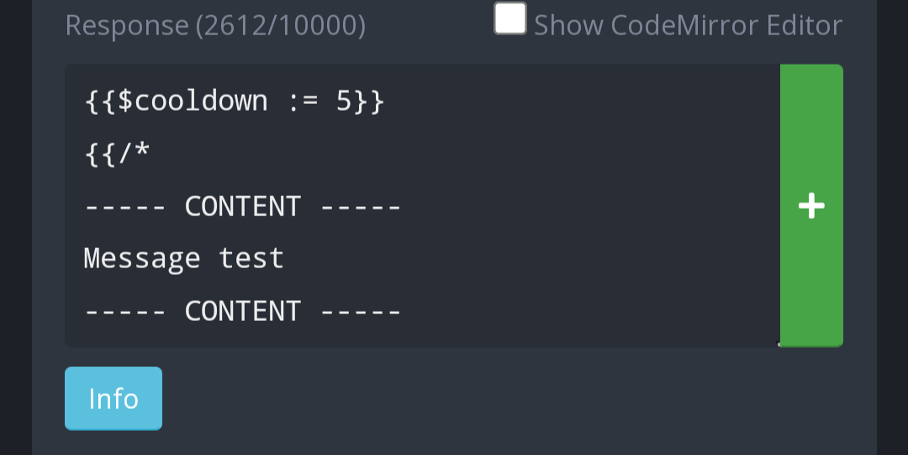

# Custom Command Template
Code which you can freely, easily edit to add your own output text. You can change the title, the description, the message content, the footer and add an attachment. You can also optionally add the chronometer custom command to your server, which will send the use of custom commands monthly. Good to keep track of the least used ones.

# Use
The use of the custom command template is arbitrary, you can configure your own trigger.

# Set up
Create a new custom command. As the trigger, you can configure whatever you deem convenient. For example, I set mine to be -template:

You can optionally configure the $cooldown. This sets how often can the custom command be ran. To prevent spam of the command, it is set as 5 as default (seconds).  

Now you can start writing your custom command. You have to write your text between the boundaries; there are four boundaries  
--- CONTENT ---  

--- CONTENT ---  

--- TITLE --- 

--- TITLE ---  

--- DESCRIPTION ---  

--- DESCRIPTION ---  

--- FOOTER ---  

--- FOOTER ---   

--- ATTACHMENT ---  

--- ATTACHMENT --- 

You have to write your text between those boundaries, careful to not edit the boundaries themselves. For example, this is how I configured mine:  

----- CONTENT -----  

Message test  

----- CONTENT -----  

----- TITLE -----  

Edit this to change the title  

----- TITLE -----  

----- DESCRIPTION -----  

A nice description for your custom command.
Supports images too  

----- DESCRIPTION -----  

----- FOOTER -----  

Random text which serves no purpose  

----- FOOTER -----  

----- ATTACHMENT -----  

https://media.discordapp.net/attachments/427893900594774026/1336104331472142482/jupiter_great-red-spot-and-southern-hemisphere.sp.jpg?ex=67a297a0&is=67a14620&hm=09a64d6ae16980fe423f43417c03732542acc3735b2feebc29c9fb31c4e43a32&  

----- ATTACHMENT -----

This is what it looks like:  

That's about it. 
You can optionally add the second custom command in the folder, which will send a monthly report of the use of this template. It looks like this:  

To add this, create a new Custom Command. As the trigger type set "crontab", and as trigger set "0 0 1 * *". It should look like this:  

  

Notice the box which says "Channel". This is the channel where the reports will be sent in.  
That's about it for this Custom Command.
