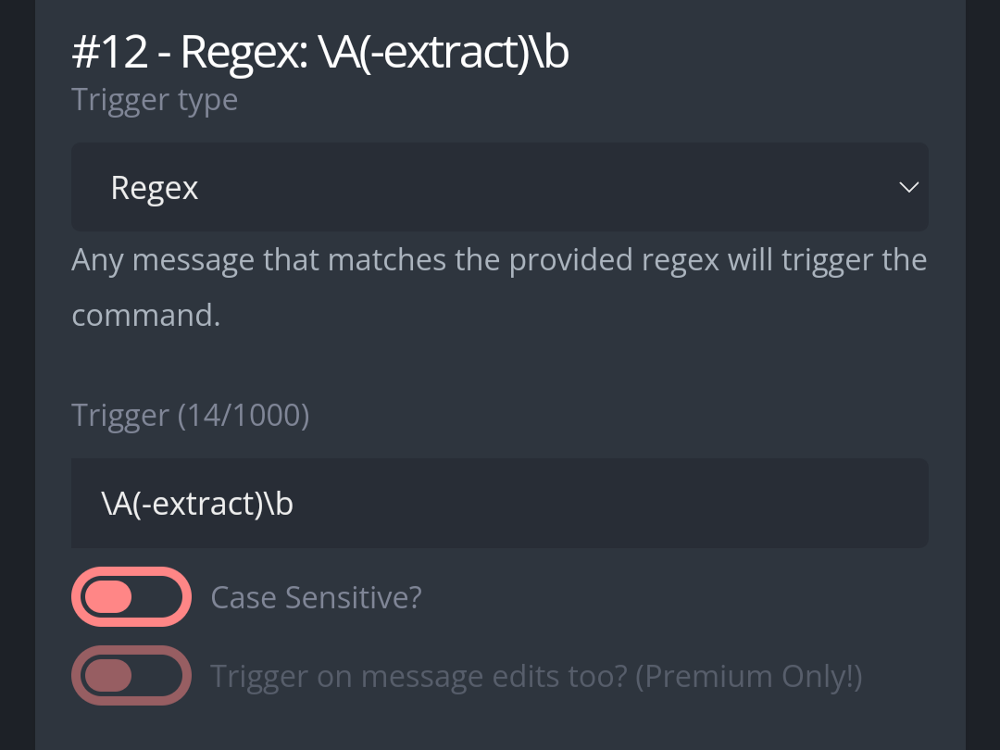

# Extract 
Send all the text of an embed message as plain text. Good for mobile users who need to copy something specific from the embed.  

# Usage
**-extract** Get the text from an embed. You have to reply to the message you want to get text from.  
**-extract [Number]** Get the text from an embed. By default, the command only sends text from the first embed, if the message contains more than one embed, you have to specify which embed to extract by indicating its position, for example: -extract 2; get the text from the second embed.  

# Set up  
Create a new Custom Command, in the response box, copy-paste the code found in "Regex: \A(-extract)\b". Configure the trigger type and trigger as follows:  

  

Configure which roles can use the command as you like. Then it's ready to use.
