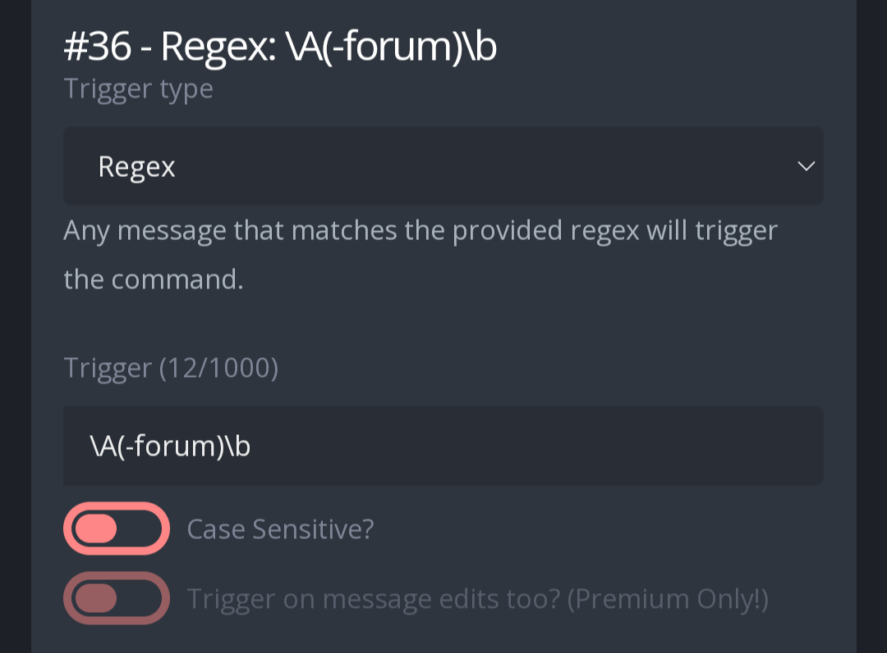
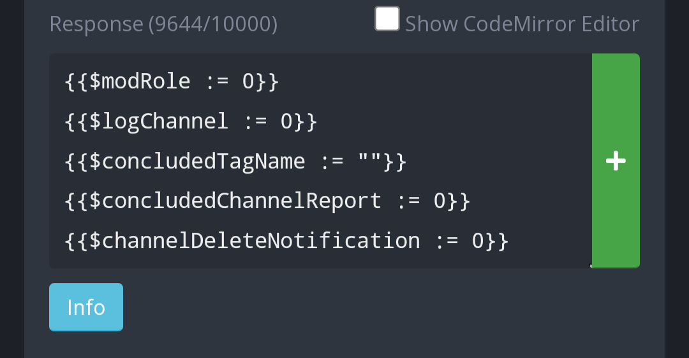
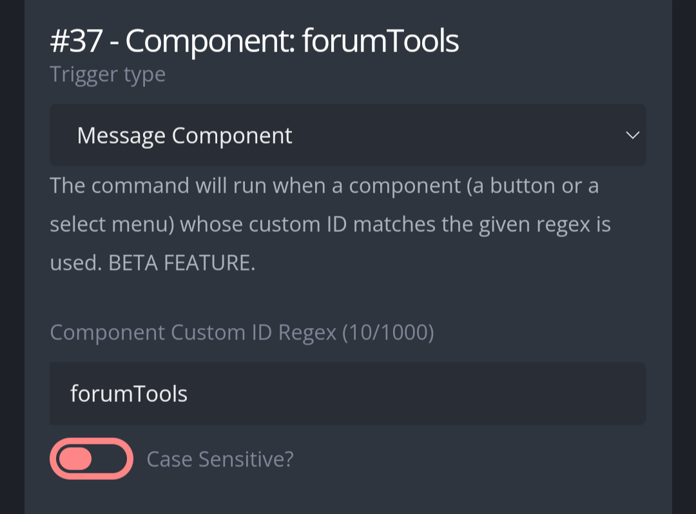
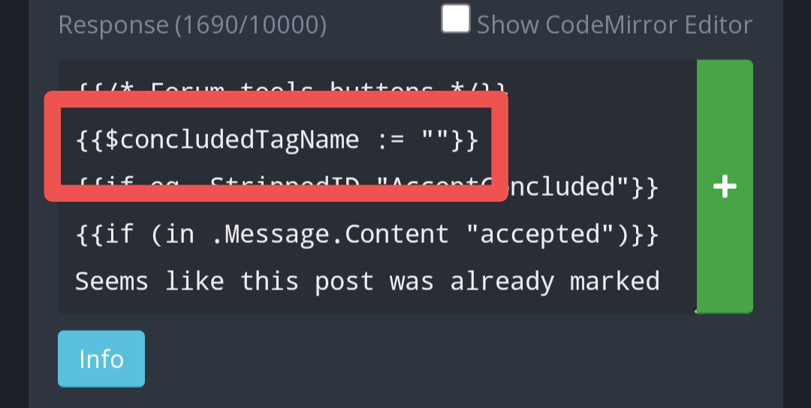

# Forum tools
A compilation of forum tools in form of a custom command. Good for moderators who may have trouble navigating through the interface.  

# Use  
**-forum** list all the tools available  
**-forum tag [Tag name]** Add a tag to the current post. If the tag is already added, remove it instead  
**-forum close** Close the current post. 
**-forum lock** Lock the current post. Note that you can't lock a closed post, but you can close a locked post  
**-forum closelock** Locks and closes the current post  
**-forum expire [Duration]** Sets a duration to the current post, after the duration is over, the post is closed and locked  
**-forum delete [Optional reason]** Deletes the current post. It has a delay of ten seconds, so you can cancel in case you made a mistake. The reason is sent to the owner of the person in a different channel, unless a channel hasn't been configured (in which case, nothing is sent anywhere).  
**-forum concluded** Adds a tag to the current post and schedules it for closing and locking in 12 hours. This configuration is optional, and can also be used by non-moderators to send a report in a different channel instead  

# Set up  
First create a new Custom Command. In the response box, paste the code found in "1. Regex \A(-forum)\b". Configure the trigger type and trigger as follows:  

  

You can now configure the variables found in the first five lines of the code:  

  

**{{$modRole := 0}}** Here you configure the role ID of the server moderators/staff role. This is important to keep regular members from using any other tools that isn't the "concluded" tool. Replace the 0 with your role ID, for example: {{$modRole := 1234567890}}  
**{{$logChannel := 0}}** Here you configure the channel ID of a log channel, where logs will be generated for uses of the command. Replace the 0 with your channel ID, for example: {{$logChannel := 1234567890}}. Can be left as zero to not log anything anywhere.  
**{{$concludedTagName := ""}}** Here you configure the name of the tag which indicates the post is "concluded", "resolved", etc. Write the tag name between the "", for example {{$concludedTagName := "Concluded"}}. Case sensitive. The quotes can be left empty to disable this tool.  
**{{$concludedChannelReport := 0}}** Here you configure the channel ID for the channel where concluded suggestions are sent. Keep it a channel which only server moderators can use. Normally, a moderator uses "-forum concluded" to mark posts as concluded, but when a regular member uses this tool, instead of adding the tag, it will send a report styled message in this channel where server moderators can review the post. Can also be left as zero to disable member reports altogether.  
**{{$channelDeleteNotification := 0}}** Here you configure the channel ID for the channel where delete reasons are sent. It is recommended to set a channel which every member can, at least, read. When a moderator deletes a post with a reason, that reason is sent here, tagging the post owner. Can be left as zero to disable.  

That's about it for this Custom Command. If you are going to let members report posts which may need to be marked as "concluded", it is necessary you configure another Custom Command:  
Create a new Custom Command, in the response box, paste the code found in "2. Component: forumToolsEnigma". Configure the trigger type and trigger as follows:  

  

In the code, you will have to configure the first line of code:  

  

**{{$concludedTagName := ""}}** Here you set the name of the tag (case sensitive), Write the name inside the "".  

That's all for this Custom Command, you can now begin to use it.
