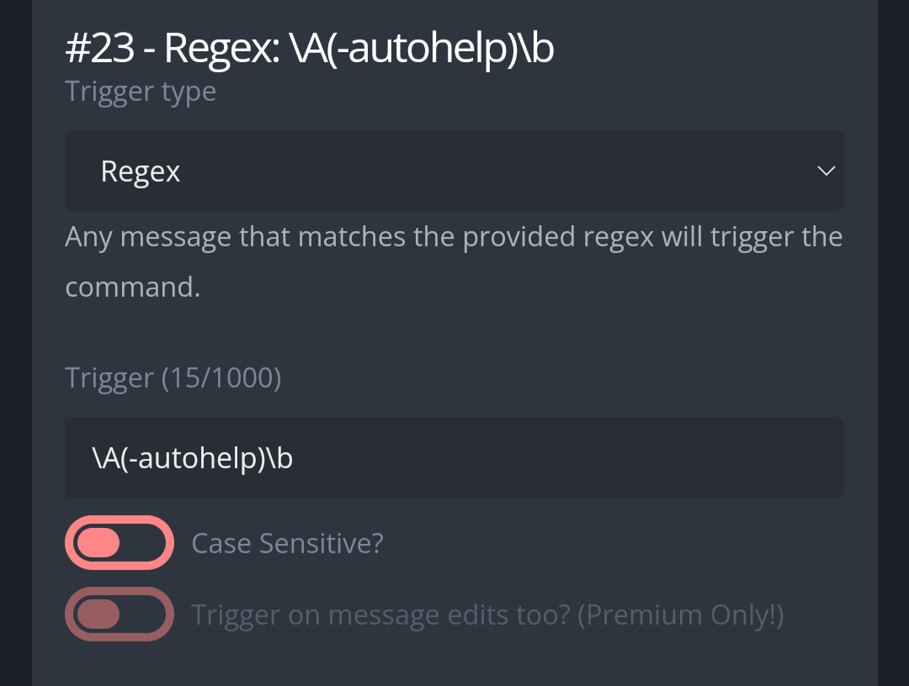
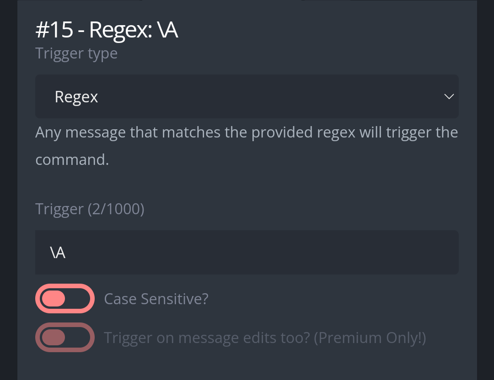
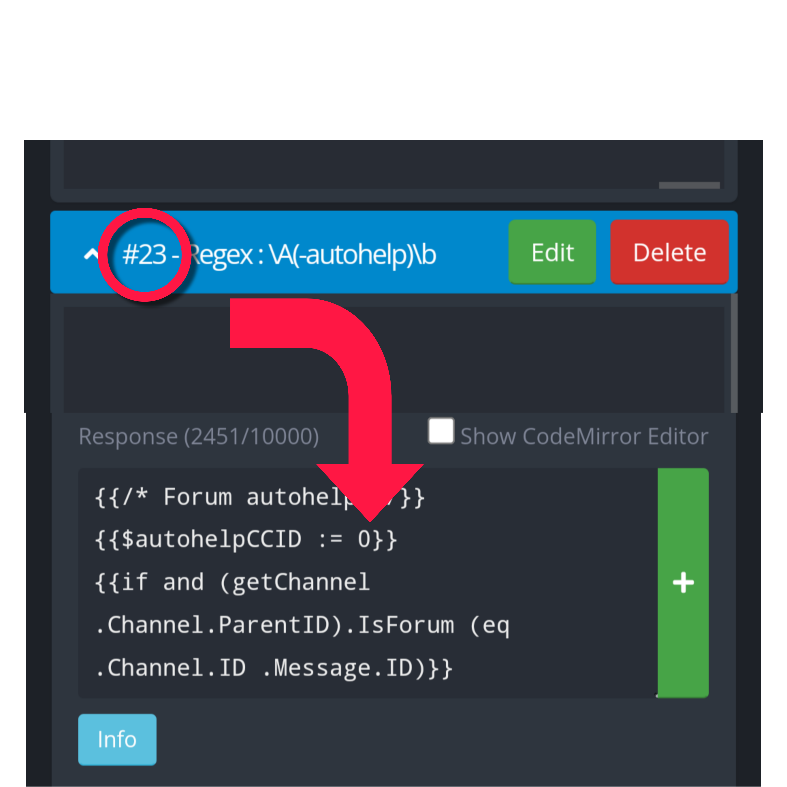
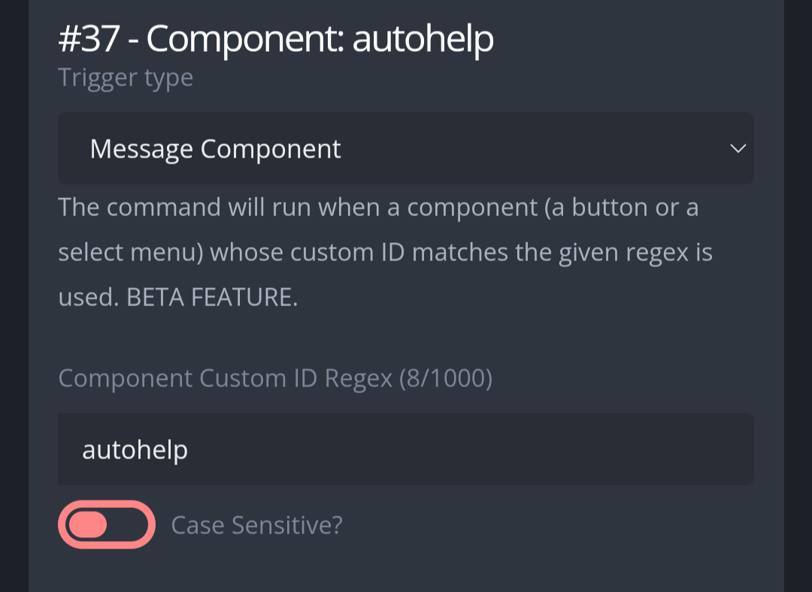
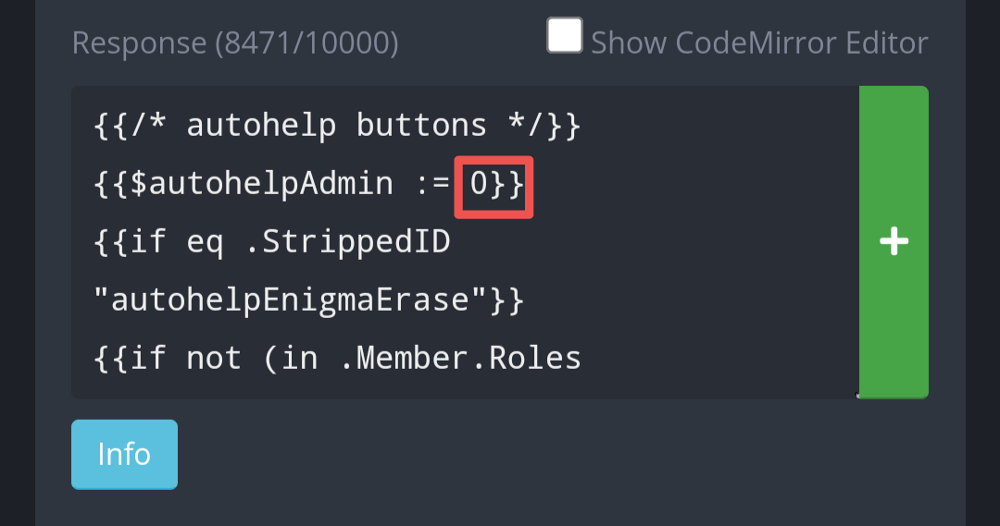
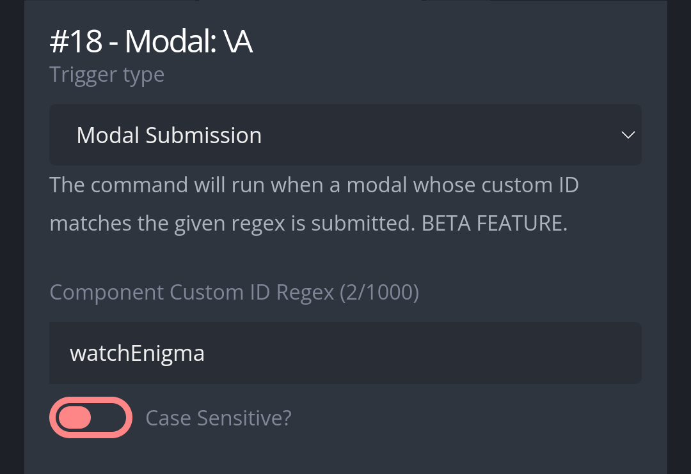

# Autohelp
Automatically responds to new forum posts. You can configure the words it responds to, and what is the message that is sent.  

# Use
**-autohelp** List all tools  
**-autohelp list** List all the automatic messages and which words do they respond to  
**-autohelp test [text]** test for yourself tye functionality of the command without having to open a new post in a forum channel.  
**-autohelp database** Exposes the content in the database, while also showing how filled it is. There is a limit in how much you can add to the autohelp, so be checking the database every now and then.  

# Set up
Coreate a new Custom Command, in the response box, paste the code found in "Regex: \A(-autohelp)\b". Configure the trigger type and trigger as follows:  

  

Limit this Custom Command to bot channels. Afterwards, create another Custom command, in the response box, paste the code found in "Regex: \A". Configure the trigger type and trigger as follows:  

  

This Custom Command will run in all messages sent. For that reason, it is recommended that you paste this code in a Custom Command which you already had triggering in all messages. Should be functional at the top of the code if so.  
In the code, there is a small line of code you have to edit, {{$autohelpCCID := 0}}. Replace 0 with the ID of the Custom Command you added previously.  

  

Configure this Custom command to, at least, run in the forums channels, not ignoring any roles.  
Afterwards, create a new Custom Command, in the response box, paste the code found at "Component: autohelpEnigma". Configure the trigger type and trigger as follows:  

  

This Custom Command does not need to be limited to channels nor roles. However, at the start of the code there is a line you have to edit; {{$autohelpAdmin := 0}}. Replace 0 with the role ID of those who will be able to add, edit and remove automatic messages. It is designed this way to enable regular members to check what are all the automatic message, but only allowing server moderators and admins to edit stuff.  

  

Afterwards, create a new Custom Command, in the response box paste the code found in "Modal: autohelpEnigma". Configure the trigger type and trigger as follows:  

  

This Custom Command does not need to be limited to channels nor roles. You can now use this Custom Command.
