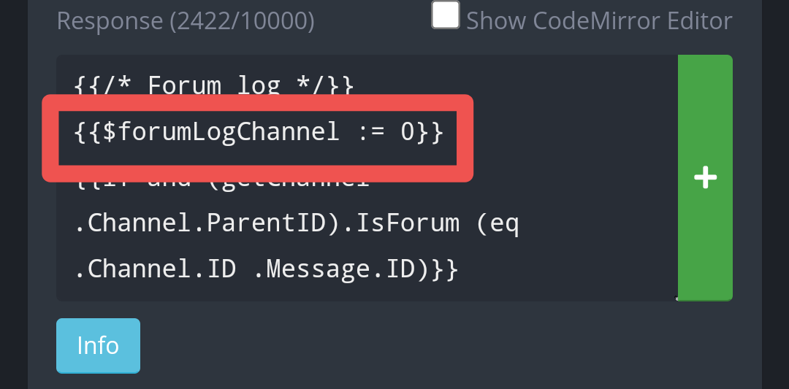

# Forum log
Creates log for new posts in forum channels. Good to centralize moderation into one channel.  

# Use  
This command is passive, does not need to be used by anyone.  

# Set up  
Create a new Custom Command, in the response box, paste the code found in "1. Regex: \A". Configure the trigger type and trigger as follows:  

  

This configures the Custom command to run in all messages. For that reason, if you already have a different Custom Command running in all messages, I recommend you paste the code in that response box. The code should work fine in the beginning of the response.  
There is a line of code which you have to edit:  

  

**{{$logChannel := 0}}** Here you configure the channel ID of the log channel. For example, {{$logChannel := 1234567890}}.  

Afterwards, create a new Custom Command. In the response box, paste the code found in "2. Component: forumEnigma". Configure the trigger type and trigger as follows:  

  

This Custom Command doesn't need further configuration. Afterwards, create a new Custom Command, in the response box, paste the code found in "3. Modal: forumEnigma". Configure the trigger type and trigger as follows:  

  

This Custom Command has one line of code you have to change:  

**{{$eraseLogChannel := 0}}** When you use the button to delete a post, that reason is sent in this channel tagging the owner of the post. Therefore you should make this a channel where everyone has, at least, read access. Can be left as zero if you don't want the reason to be sent anywhere.
That's about it, the Custom Command should begin working as intented
