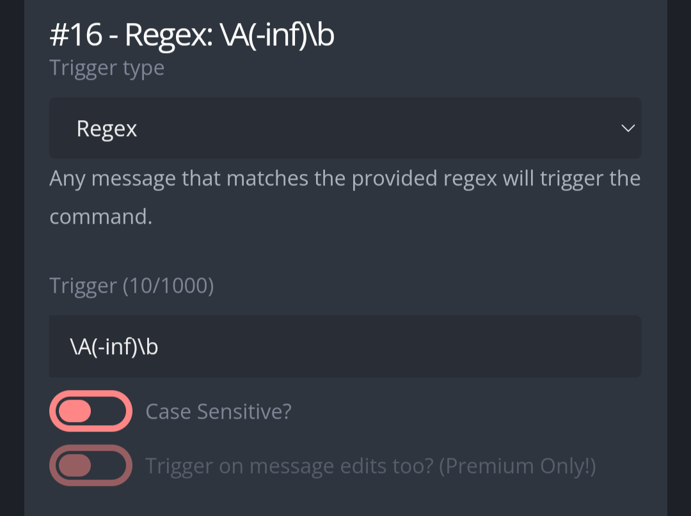
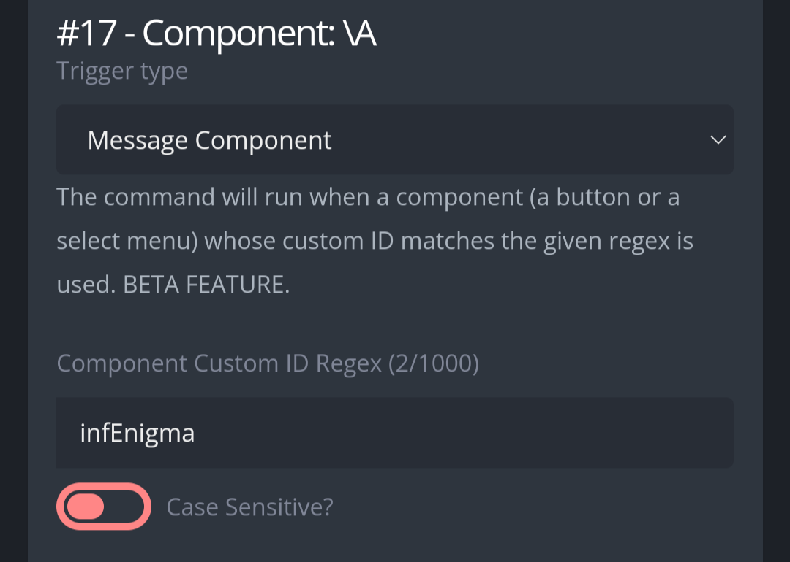

# Inf
Generate a template for infractions. Good for those infraction reasons which are repetitive.  

# Usage  
**-inf [User ID] [Template]** generate a templated infraction reason for the ID provided.  
**-inf admin** Show all admin tools where you can add, edit or remove templates.  

# Set up
Copy the code found in "Regex: \A(-inf)\b" and paste it in a new custom command. The trigger type and trigger have to be set up as follows:  

You can limit channels and roles as you wish, ideally you enable it in moderator channels and roles.  
After configuring this custom command, copy the code found in "Component: infEnigma" and paste it in the response box of a new custom command, configure the trigger type and trigger as follows:  

  

Do not configure "Ignore the following channels" nor "ignore the following roles".  
After configuring this custom command, create a new one and paste the code found in "Modal: infEnigma" into the response box. Configure the trigger type and trigger as follows:  

  

Do not configure "ignore the following channels" nor "ignore the following roles".  
That is all, enjoy!
