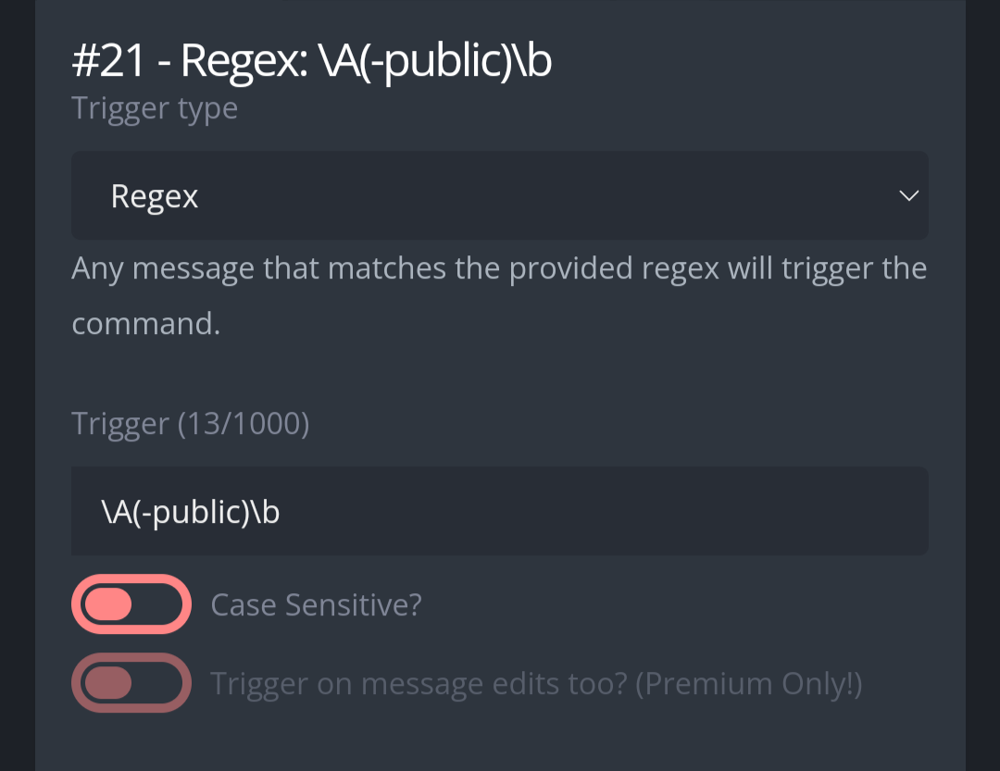

# Public  
Filter sensitive/irrelevant information from the list of infractions for the bot Gearbot.  

# Use  
**-public [Infractions]** Copy and paste the infraction list of a member and use it as an argument. The bot will filter information.  

# Set up  
Create a new Custom Command, in the response box, copy-paste the code found in "Regex: \A(-public)\b".  Set up the trigger type and trigger as follows:  

  

Then it's ready to be used.
