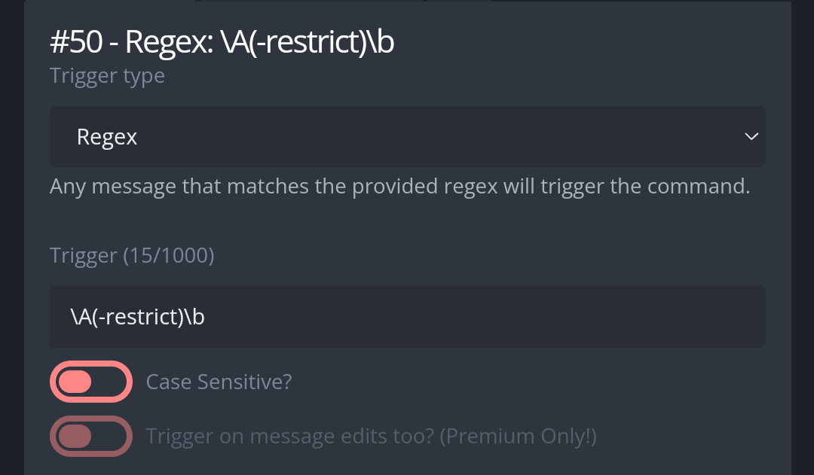
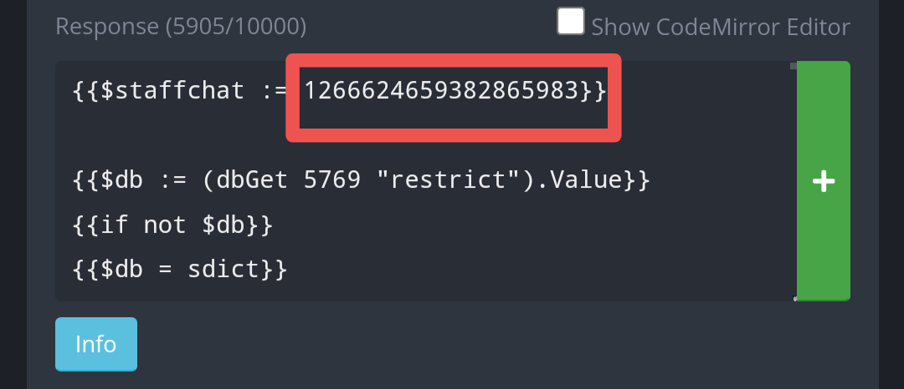

# Restrict
A custom command that adds a role which restrict channels from a channel or a system. You link a channel to a role, and then the command begins working. You can either run the command directly in the channel to restrict the member from, or specify it in the command. This tool will add the role temporarily, by default 30 days, and then will take it away.

# Use
**-restrict [user] [days]**: Restricts the targeted member from the current channel. Days is optional, defaulting to 30 if it's not specified.

**-restrict [user] [channel] [days]**: Restricts the targeted member from the channel specified, rather than current one. Days is optional, defaulting to 30 if it's not provided.

**-restrict [user] [keyword] [days]**: Restricts the targeted member from whatever system that isn't channel based. 

**-restrict admin**: Configure bonds between channels and roles.

**-restrict admin list**: Show all configured pairs.

**-restrict admin add [channel] [role]**: Add a new bond, if the member is restricted from this channel, then add that role. Channel can be a #channel mention or channel ID, role can be @role mention or role ID.

**-restrict admin add [keyword] [role]**: Add a new bond between a keyword and a role, for non-channel based restrictions. 

**-restrict admin remove [channel]**: Removes the bond between the channel and whatever role was associated to it. After this, the command can no longer be used to restrict a person from that channel, unless reconfigured.

**-restrict admin remove [keyword]**: Removes the bond between a keyword and it's associated role.

# Set up
First create a new custom command, configure the trigger type and trigger as follows:

Then, head over the code, you will have to configure the first line:

**{{$staffchat := 0}}**: The channelID where notifications will be sent. Replace the number for the channel ID of your staff bots channel.
That's it, you can now begin use, first configure your channel-role pairs and it will begin working.
