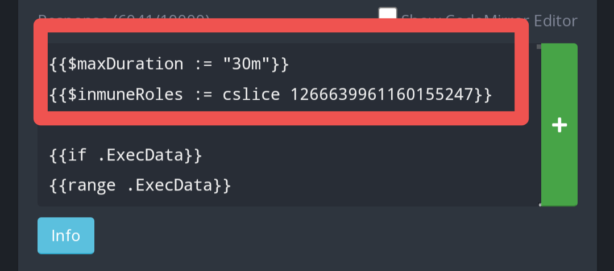

# Swift AutoModeration 
Temporarily adds to the blacklist any term or message type in site. Supports more than one automod at a time and a custom duration.  

# Use
**-sam [channel] [duration] [your keywords]** Adds the keywords to the automod. Split them using /.  

# Set up  
The set up is a little complicated and I advise it is done only for those who have basic knowledge about the interface. First, create a new Custom Command, configure the trigger type and trigger like shown here:  

  

Then, copy the code found in the file #1 and paste it in the response box.  
You can configure the maximum duration moderators can use in this Custom Command, as well as who is inmune to the automod. Edit the first lines of code, like shown here:  

  

In this case, this is configured to allow a maximum duration of 30 minutes.  
**{{$InmuneRoles := cslice}}** Here, you have to add the roles IDs which are going to be made inmune for the automod. Add your moderator roles here. If for example, your moderator and admin roles are 1234567890 and 0987654321, then you would add them to the inmune list like so: {{$InmuneRoles := cslice 1234567890 0987654321}}.  
Afterwards, create a new Custom Command, configure the trigger type and trigger like shown here:  

  

Then, copy the code found in file #2 and paste it in the response box.  

  

Warning: If you already have a custom commmand running in all messages, it is recommended that you add this code into it; it should work in the end of the response.  
After configuring this custom command, create another one, configure the trigger type and trigger as follows:  

 

Then, copy the code found in file #3 and paste it into the response box. In the "Channel/role restrictions", add the moderators roles as the roles who can use this Custom Command.  
Afterwards, create a new Custom Command, configure the trigger type and trigger as shown here:  

  

Then, copy the code found in file #4 and paste it into the response box. This custom command does not need further configuration.

That would be it, you can now begin use
