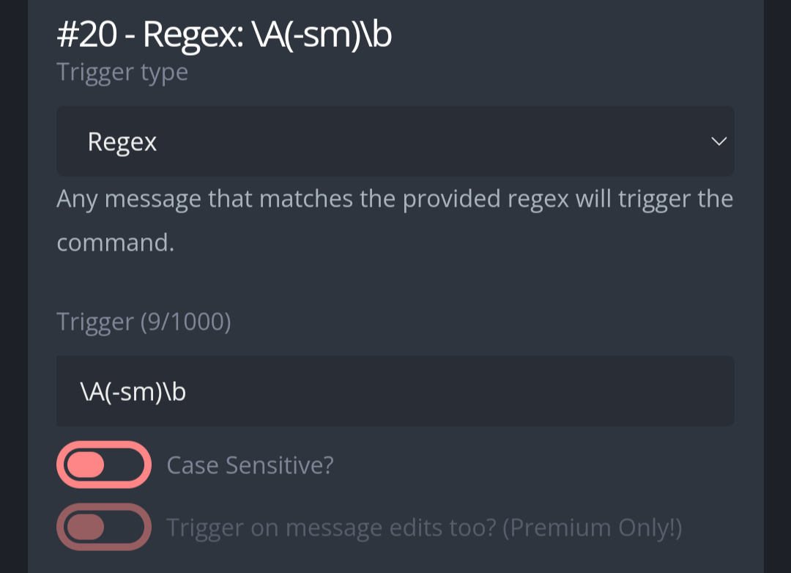
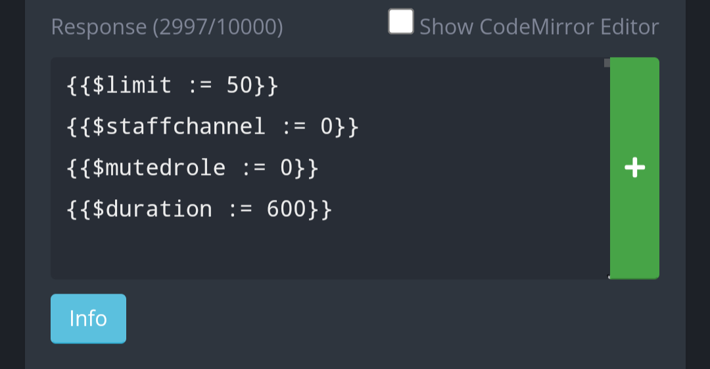

# Swift Mute  
Immediately mute a member without the need of a reason or a duration. A powerful tool for fast-paced chats.  

# Use  
**-sm [targets] [Number]** Mute members who are tagged in the message. You can set an optional number below 100, which indicates how many messages to delete for the first five targets. Order of arguments doesn't matter.  

# Set up  
Create a new Custom Command, in the response box, paste the code found in "Regex: \A(-sm)\b". Configure the trigger type and trigger as follows:  

  

In the code itself, there are four other settings:  

  
**{{$limit := 50}}**: How many messages can moderators remove, at most, per person targeted. Pretty important to avoid moderators deleting huge amounts of messages. Max limit is 100.  
**{{$logchannel := 0}}**: Replace the 0 for the channel ID of the log channel. Messages confirming who got swift muted will be sent here. It is recommended to set the same channel where moderators run commands.  
**{{$mutedrole := 0}}**: Replace the 0 for the role ID of the muted role. It is not recommended to use the same muted role which is used for "regular" mutes, because this custom command has it's own duration and will take away the muted role.  
**{{$duration := 600}}**: The duration of the swift mute, in seconds. All swift mutes will have this duration.  
It is necessary to enable the native "clear" command found in the moderation section of the control panel.

If everything is configured properly, you can begin use.
