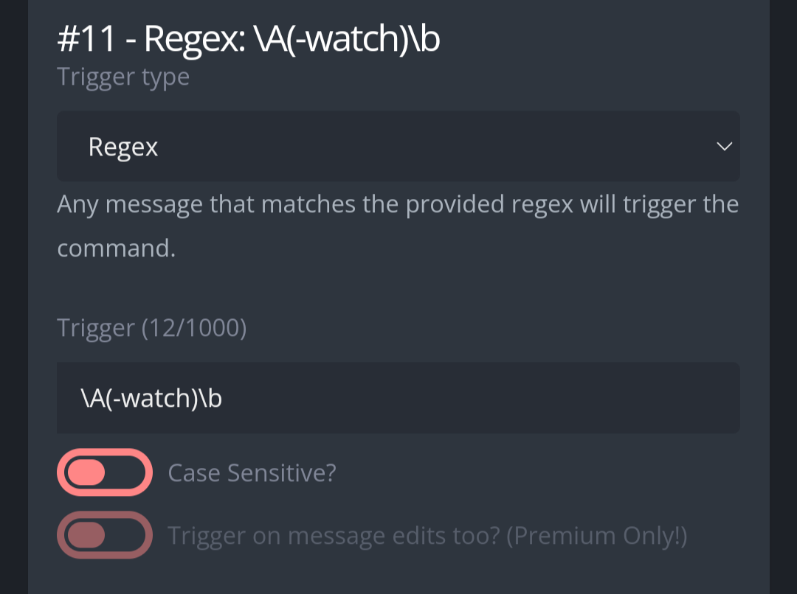
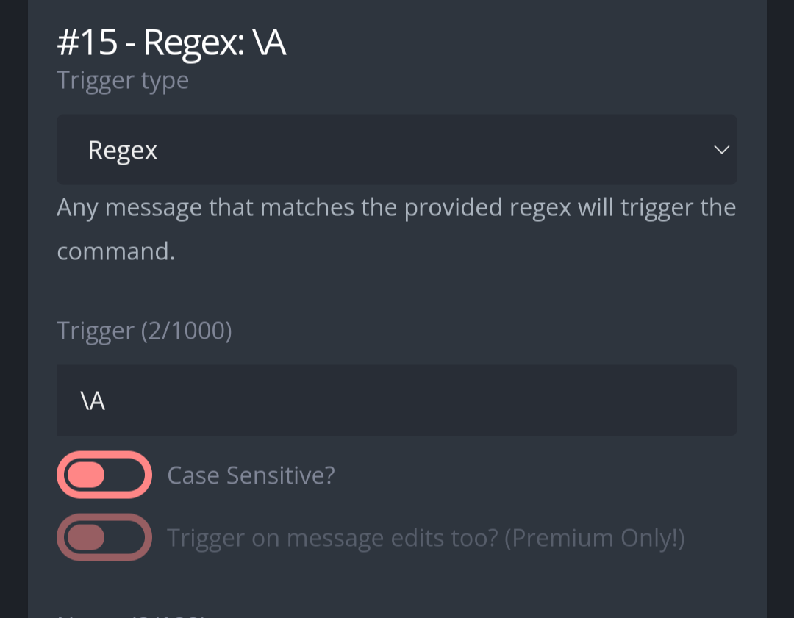
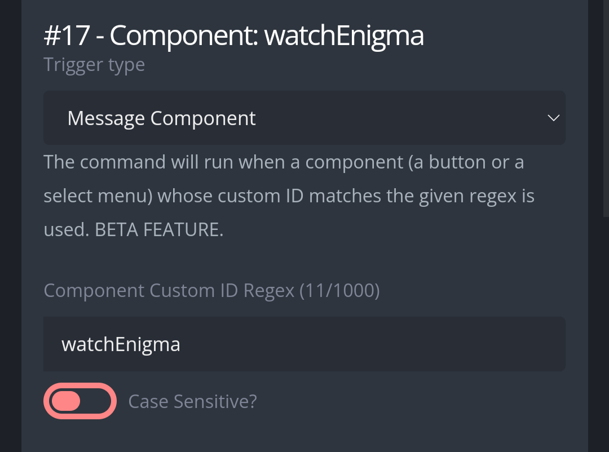
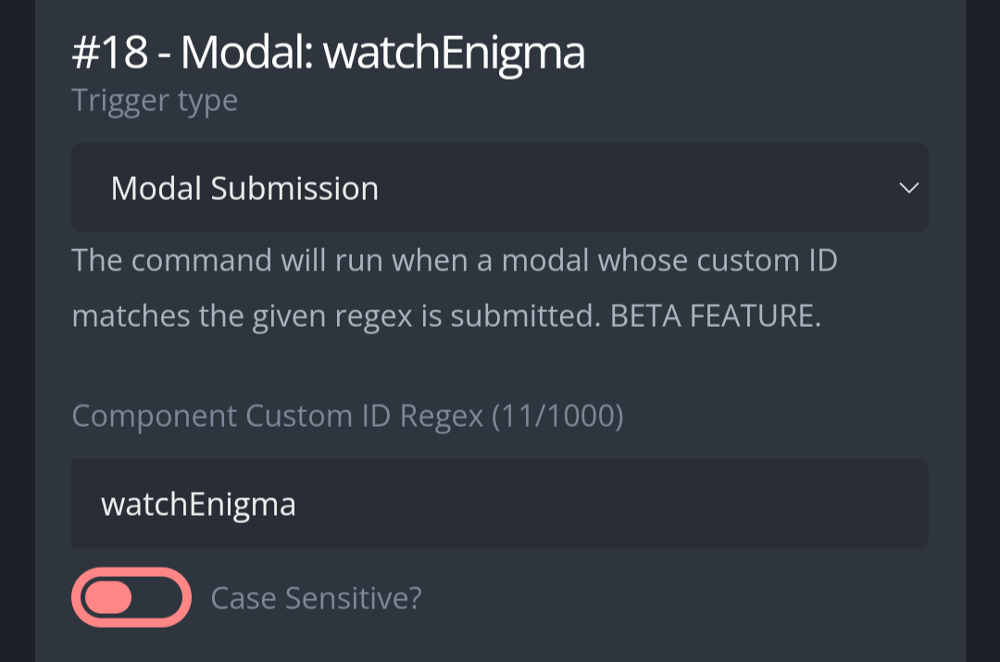

# Watch
Track messages of a member, or in a channel, log those which have key words.  

# Usage
**-watch [Target] [Duration] [Keywords]** enable tracking against a person or channel. Maximum duration is of 50 days.  
**-watch admin** show the administrator tools. Here you can configure in which channels moderators can put tracking on, which roles are ignored and which users are ignored. Important to configure if you don't want server moderators to see messages from channels they do not have access to.  
**-watch** Explanation of the custom command, and also where moderators can sign up to be tagged for every catch. By default, when a message is caught, a log is generated in a channel, enable "instant tag" to be tagged in the message of the log.  

# Set up
Create a new Custom Command, in the response box, copy the code found in "Regex: \A(-watch)\b", and configure the trigger type and trigger as follows:  

  

Configure the first two lines of code, replacing the 0 in {{$admin := 0}} with the admin role ID (admins will be able to edit the whitelist of channels) and replacing the 0 in {{$logchannel := 0}} by the logging channel. Here, all flagged messages will be sent.  Add the moderator role in "Requires at least one of the roles in the following list" at the bottom of the interface.  
Afterwards, create a new Custom Command, copy in the response box the code found in "Regex: \A", and configure the trigger type and trigger as such:  

  

This Custom Command will run in all messages sent, hence it can be disruptive if misconfigured. If you already have another Custom Command which is running in all of the messages sent, then you can paste this code in it, should be fine on top of all the code. It's not necessary to configure in which channels this Custom Command is running in, as the limits can be configured in the command itself by running **-watch admin**.  
Afterwards, create a new Custom Command, copy the code found in "Component: watchEnigma" and paste it into the response box. Configure the trigger type and trigger as follows:  

  

Afterwards, create a new Custom Command, copy the code found in "Modal: watchEnigma" and paste it in the response box. Configure the trigger type and trigger as follows:  

  

Lastly, run **-watch**, if the command has been configured properly, it should say "initialized". You can use it afterwards, but don't forget to set the whitelisted channels!
