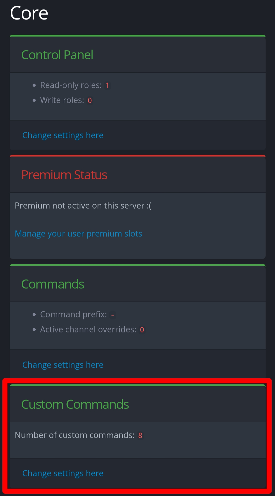
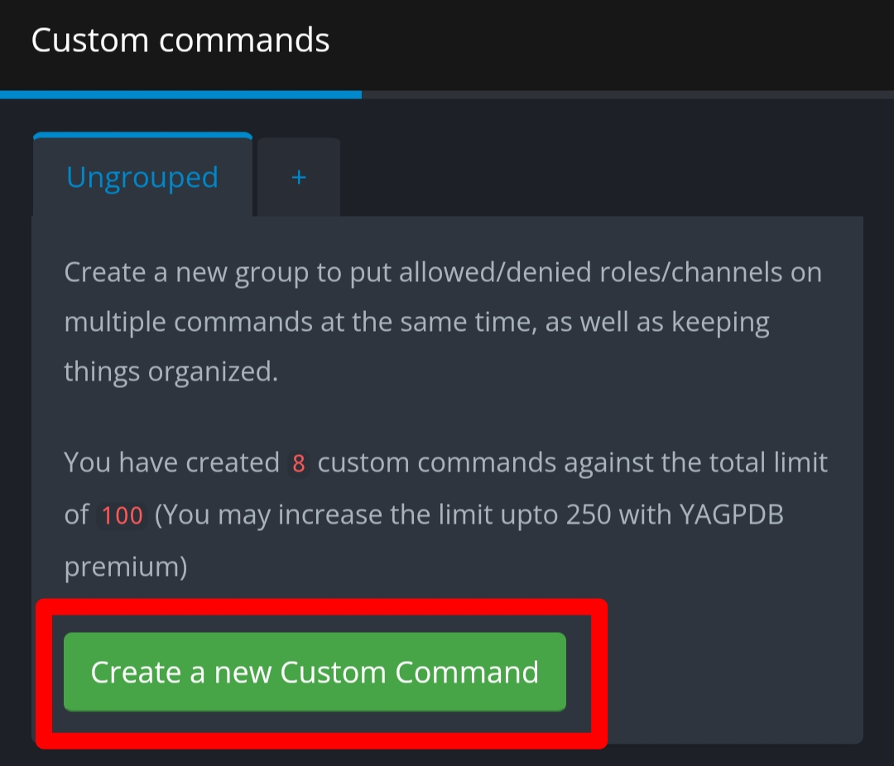
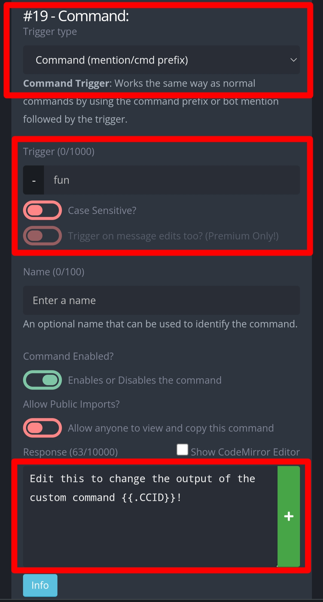

# YAGPDB-custom-commands
Custom commands made by its.enigma for discord bot YAGPDB. Those custom commands have a manual in them, which explain how to set them up and how to use them.

# How to add custom commands 
In the interface of the website, head to "Custom Commands"

Click in "create a new custom command" afterwards.

This is the interface for custom commands. In the first red box, you will configure how is the command executed (after a message is sent? after a reaction is added? after a button is used?), in the second red box you will configure what are the keywords of the trigger. In the last box, you will paste the code of the custom commands you will find here, depending of how each is instructed to be configured.

